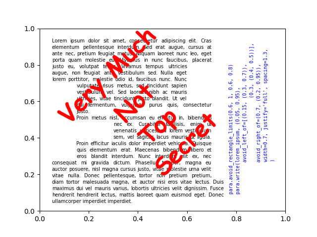

Welcome to ParaMPL's documentation!
===================================

ParaMPL allows writing of justified paragraphs to matplotlib plots: 'full', 'center', 'left', 'right'.

For each word, it first writes the word invisibly, storing its length. Then, the paragraph is split in lines of
appropriate length.
The cache of each word's length is kept for each particular font.

An example run in quickstart.py produces:

.. toctree::
   :maxdepth: 2
   :caption: Contents:

   API reference <source/api>

